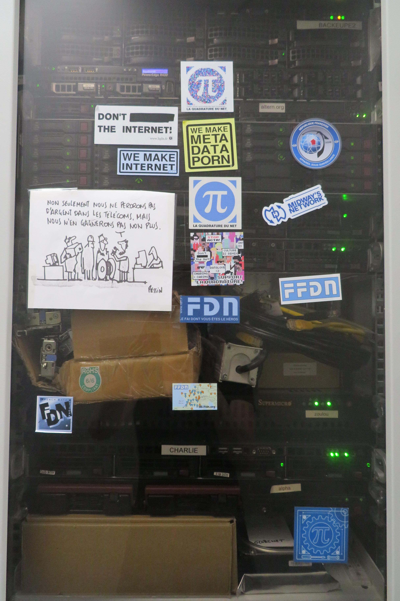
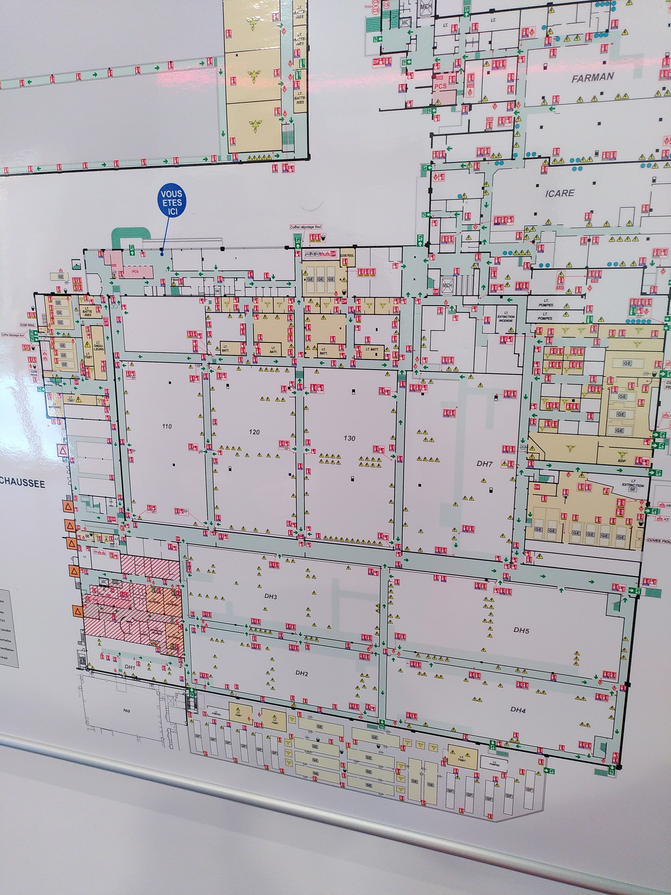
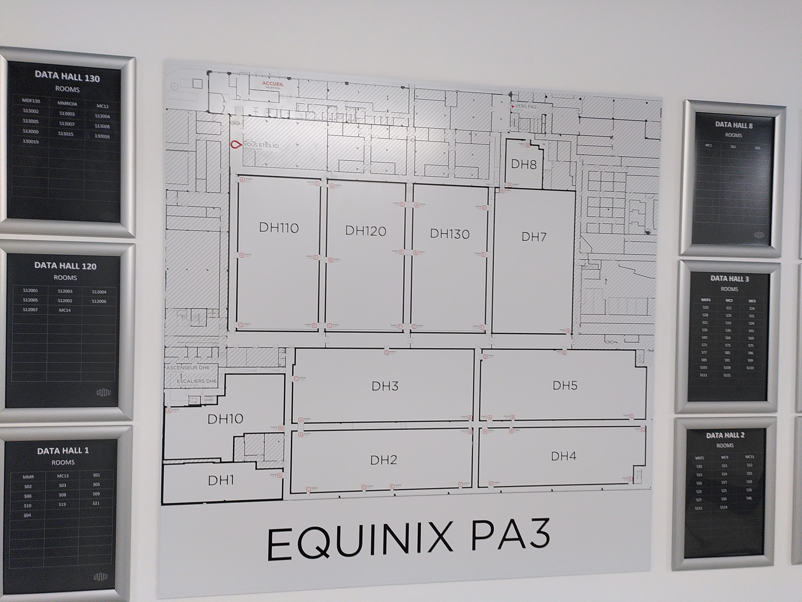
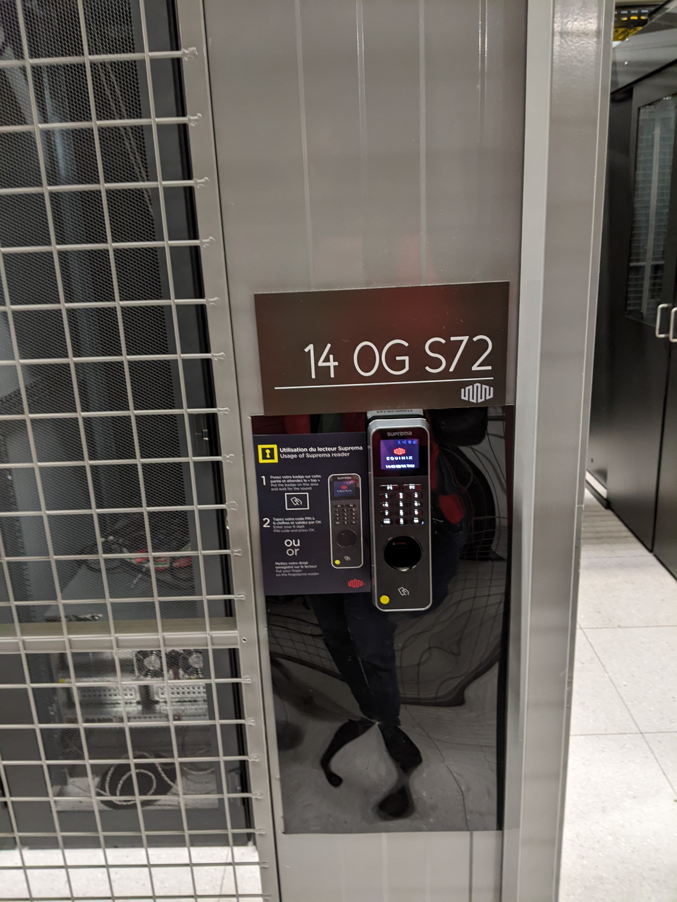
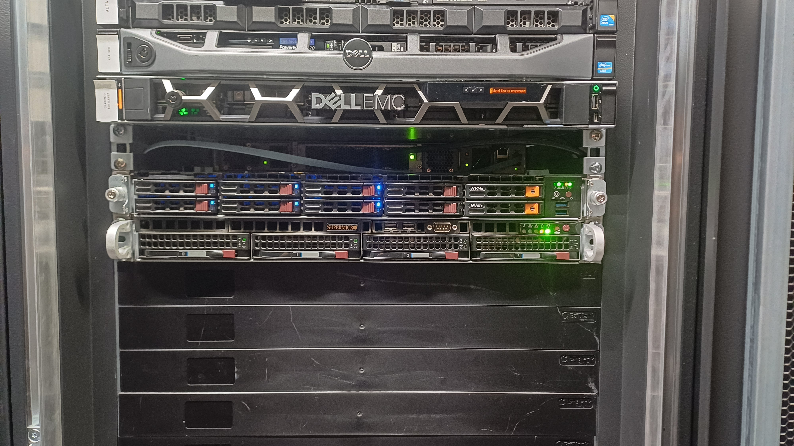
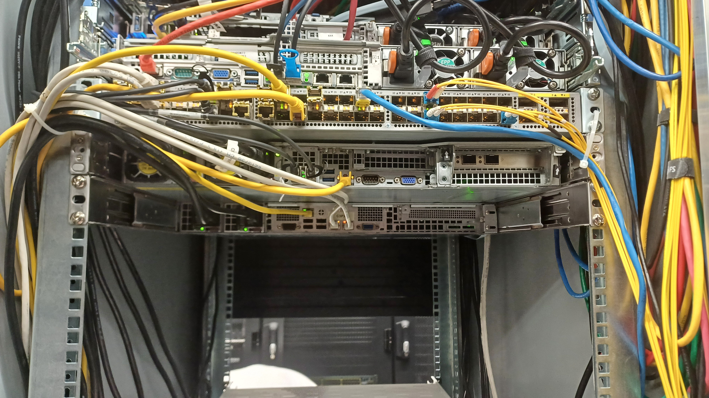

FDN dispose de deux *points de présence* (POP), à Paris. Il s'agit de
*Telehouse 2* (TH2) et *Equinix PA3* (PA3).

# Téléhouse 2 (TH2) -- 11A4

TH2 est le datacenter historique de FDN, depuis la création de Gitoyen en 2001.
Gitoyen y dispose d'une baie (la `11A4`). Dans cette baie se
trouvent des équipements de Gitoyen, mais aussi de certains de ses membres,
comme FDN, qui louent de l'espace à Gitoyen.

Adresse :

    137 boulevard Voltaire
    75011 Paris

Matériel de FDN :

 - 1 switch Cisco Nexus 3064 10G
 - 1 ancien droïde [r4p17](./machines/r4p17.md)
 - 1 NanoPi pour l'[OOB](../../outils_internes/acces_de_secours.md)

La baie 11A4 est gérée par Gitoyen. On y intervient en accord avec leur équipe,
avec eux quand c'est possible. En cas d'urgence réelle, FDN peut accéder à la
baie en autonomie.

Pour voir d'anciennes photos, c'est par ici : [archives photos](./points_de_presence/archives/).

# PA3 -- Data Hall 3, Cage 14 OG S72, baie 114

PA3 est un datacenter géré par la société *Equinix*. FDN, comme d'autres
structures de l'écosystème Gitoyen, a souhaité y mettre des machines.

FDN loue quelques U de la baie Gitoyen, la `114`. Dans cette baie se
trouvent des équipements de FDN.

Adresse :

    114 Rue Ambroise Croizat, Saint Denis
    93200 Paris

Matériel de FDN :

 - 1 switch cisco N3K-3064PQ-10GX
 - 1 droïdes [r5d4](./machines/r5d4.md)
 - 1 ancien droïdes [c3px](./machines/c3px.md)
 - 1 NanoPi pour l'[OOB](../../outils_internes/acces_de_secours.md)

