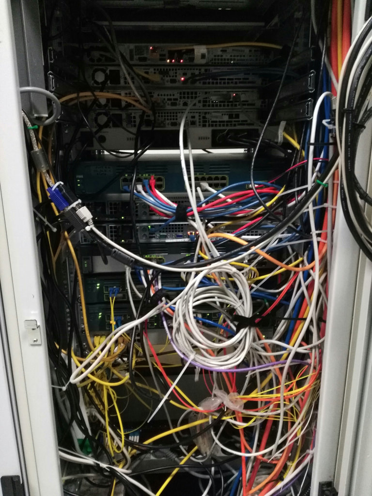
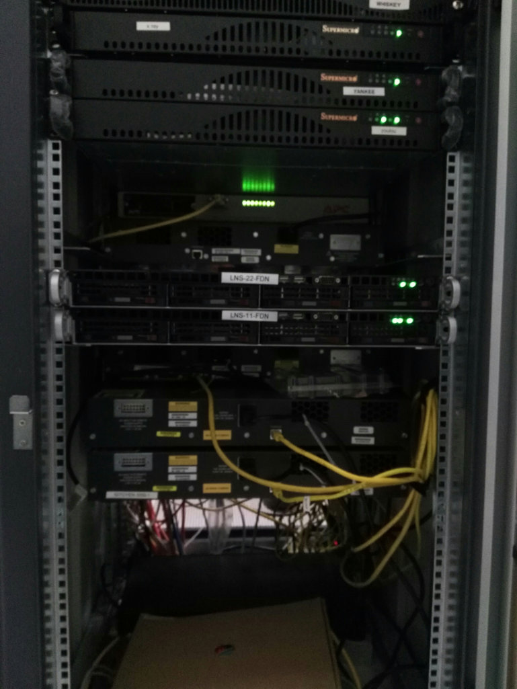
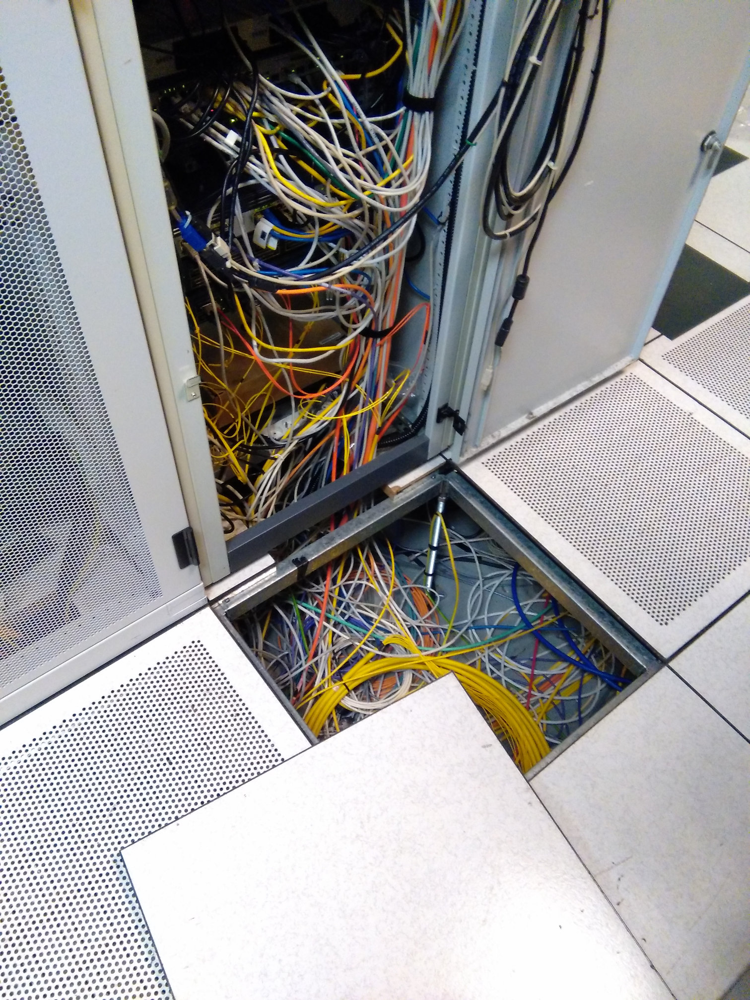
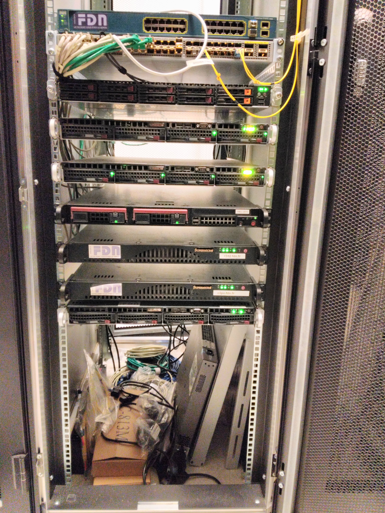
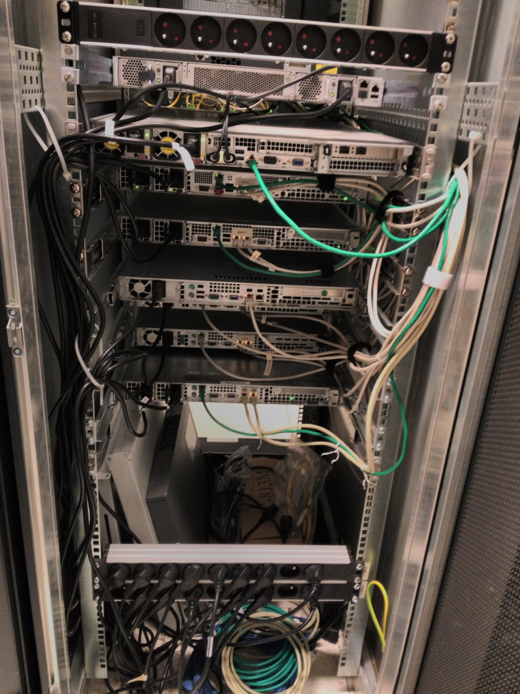

FDN dispose de deux *points de présence* (POP), à Paris. Il s'agit de
*Telehouse 2* (TH2) et *Paris Bourse* (PBO).

# Téléhouse 2 (TH2) -- 11A4

TH2 est le datacenter historique de FDN, depuis la création de Gitoyen en 2001. 
Gitoyen y dispose d'une baie (la `11A4`). Dans cette baie se
trouvent des équipements de Gitoyen, mais aussi de certains de ses membres,
comme FDN, qui louent de l'espace à Gitoyen. 

Adresse :

    137 boulevard Voltaire
    75011 Paris

Matériel de FDN :

 - 1 switch Cisco 2970
 - 2 LNS ([lns11](./machines/lns11.md) / [lns22](./machines/lns22.md))

La baie 11A4 est gérée par Gitoyen. On y intervient en accord avec leur équipe,
avec eux quand c'est possible. En cas d'urgence réelle, FDN peut accéder à la
baie en autonomie.

# Paris Bourse -- Z1A11

Paris Bourse est un datacenter géré par la société *Liazo*. FDN, comme d'autres
structures de l'écosystème Gitoyen, a souhaité y mettre des machines, notamment
parce que l'électricité y est bien moins chère qu'au TH2.

FDN loue (en direct) à Liazo une demi-baie, la `Z1A11`. Dans cette baie se
trouvent des équipements de FDN, et des équipements hébergés par FDN pour des
tiers.

Adresse :

    35 rue des Jeûneurs
    75002 Paris

Matériel de FDN :

 - 1 switch cisco N3K-3064PQ-10GX
 - 1 ancien switch cisco (port 1G)
 - 1 droïdes ()
 - 2 anciens droïdes ([r4p17](./machines/r4p17.md) / [c3px](./machines/c3px.md))
 - 2 anciens anciens droïdes ([r2d2](./machines/r2d2.md) / [c3po](./machines/c3po.md))
 - 1 passerelle/lns ([lns22](./machines/lns22.md))
 - 1 APC (non utilisé)

Matériel hébergé pour des tiers :

 - 1 machine pour les RMLL (contact: kolter / olive)

