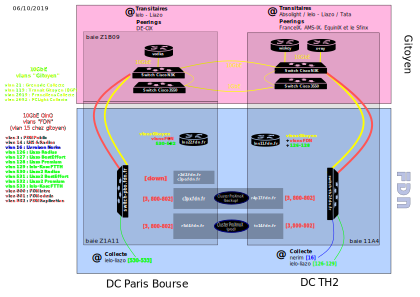

# Schéma high level du réseau FDN

Ce schéma est une ébauche, il y a des choses à modifier, corriger, améliorer.

# Explication du schéma

## Introduction

L'infrastructure de FDN est actuellement répartie dans deux datacenters
(nommés par la suite DC):

- Paris Bourse
- TéléHouse2 (nommé ensuite TH2)

Ils sont tous deux situés sur Paris.

Pour connecter son bout de réseau, FDN passe par Gitoyen.
Gitoyen a aussi une partie [ou tout ???] de son infrastructure dans ces deux
DC.

Comme on le voit sur le schéma, FDN possède une demi-baie
(la Z1A11) à Paris Bourse et partage la baie 11A4 avec Gitoyen à TH2.

## Explications et détails du schéma

Les LNS ont chacun 2 liens 1GbE:
- un pour la collecte
- un pour le transit et le réseau interne

Les connexions entre les deux switchs de Gitoyen sont en 10G.
Une des connexions fait quelques kilomètres, l'autre passe par un autre chemin
[= très bien] et fait environ 15 kilomètres.

Quasi tous les services sont sur les droides (en kvm [???]).
Cela comprend [???]:
- les VPNs
- le site FDN
- les sites des abonné·es
- les serveurs DNS
- ...

Deux droides à Paris Bourse ne sont pas utilisés actuellement [voir ce que
l'on peut en faire]

Les droides possèdent 3 liens réseaux, deux d'entre eux sont dédiés à la
réplication.

## Vocabulaires

- bgp: 'Border Gateway Protocol', permet de se connecter au monde
- ganeti: gestionnaire de VMs, permet de créer, gérer, migrer les VMs
- LNS: 'L2TP Network Server', machine debian, servant pour la collecte xDSL

# Informations complémentaires

LDN possède la VM isengard avec un nagios pour nous aider à tester l'état de
nos services.

À Paris Bourse, FDN héberge une machine physique pour les RMLL.

Schéma de la vieille collecte et du routage chez FDN:
[À l'époque avant Nérim](https://wiki-adh.fdn.fr/essaimage:ressources:schema_collecte_routage_fdn)]

# Chantiers

## Chantiers achevés

Les switch sont passés à 10G.

La redondance entre PBO et TH2 a été effectuée.

Passage à un storage ZFS sur les deux nouveaux droïdes de prod (r5d4 et tc14) - pour l'historique, voir [ici](https://git.fdn.fr/adminsys/suivi/-/issues/156#note_6504)

## Chantiers potentiels

[encore valable ?]
Les HDD des droides [???] limitent actuellement la vitesse de réplication entre
les droides (1G)

