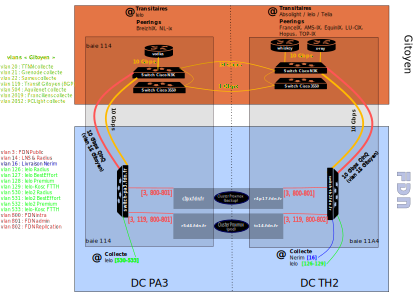

# Schéma high level du réseau FDN

# Explication du schéma

## Introduction

L'infrastructure de FDN est actuellement répartie dans deux datacenters
(nommés par la suite DC) :

- Equinix PA3 (nommé ensuite PA3)
- TéléHouse2 (nommé ensuite TH2)

Ils sont tous deux situés sur Paris.

Pour connecter son bout de réseau, FDN passe par Gitoyen.
Gitoyen a aussi une partie de son infrastructure dans ces deux
DC.

Comme on le voit sur le schéma, FDN partage la baie 114
à PA3 et partage la baie 11A4 avec Gitoyen à TH2.

## Explications et détails du schéma

Les LNS ont chacun 2 liens 1 Gb :
- un pour la collecte
- un pour le transit et le réseau interne

Les connexions entre les deux switchs de Gitoyen sont en 10G.
Une des connexions fait quelques kilomètres, l'autre passe par un autre chemin
[= très bien] et fait environ 15 kilomètres.

Tous les services sont sur les droides à l'exception des sauvegardes et switchs qui sont encore d'autres composants physiques.

Les droides possèdent 3 liens réseaux, deux d'entre eux sont dédiés à la
réplication.

## Vocabulaires

- BGP : 'Border Gateway Protocol', permet de se connecter au monde
- LNS : 'L2TP Network Server', machine debian, servant pour la collecte xDSL/FTTH

# Informations complémentaires

Chez LDN il y avait (l'asso a été dissoute) la VM isengard avec un nagios pour nous aider à tester l'état de
nos services hors du réseau FDN (accessible via https://statut.fdn.fr, https://isengard.fdn.fr, https://skytop.fdn.fr ou encore https://status.fdn.fr).
C'est depuis fin 2022 la VM skytop chez [Grenode](https://www.grenode.net/)) qui a prit le relais.

Schéma de la vieille collecte et du routage chez FDN :
[À l'époque avant Nérim](https://www.ffdn.org/wiki/doku.php?id=documentation:schema_collecte_routage_fdn)

# Chantiers

## Chantiers achevés

Les switch sont passés à 10G.

La redondance entre PBO et TH2 a été effectuée.

Passage à un storage ZFS sur les deux nouveaux droïdes de prod (r5d4 et tc14) - pour l'historique, voir [ici](https://git.fdn.fr/adminsys/suivi/-/issues/156#note_6504)
