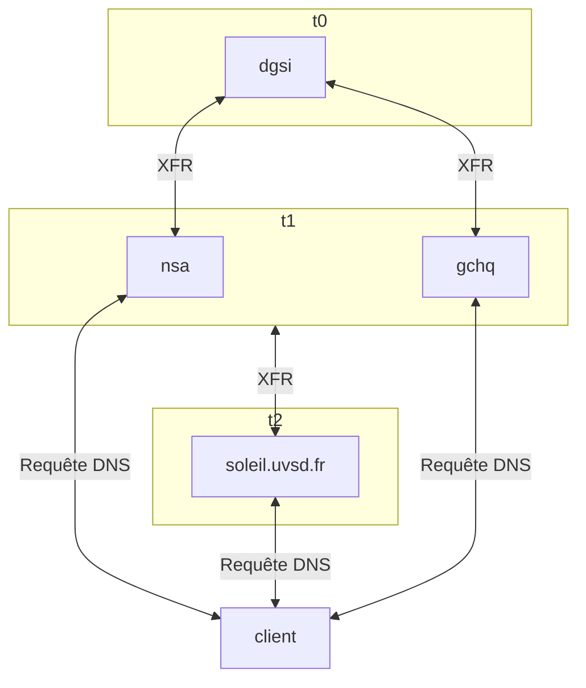

# Construction du service

[[_TOC_]]

## Concept

Le service est découpé en trois grandes catégories de flux:
  - requêtes des clients finaux aux serveurs faisant autorités
  - réplication des zones entre les serveurs faisant autorités
  - gestion des zones sur le serveur primaire

Les serveurs DNS sont réparti en trois tiers:
  - t0 &rarr; il s'agit du serveur primaire (qui sera caché). Il ne peut/doit y en avoir qu'un seul, c'est lui qui gèrera la modification des zones et la signature DNSSEC (optionel). Il a pour particularité que personne ne pourra l'interroger et seuls les serveurs du tier 1 pourront le répliquer (intégralement ou partiellement).
  - t1 &rarr; il s'agit des serveurs secondaires dont FDN a la responsabilité, ils servent à répondre aux requêtes des utilisateurs finaux et à la réplication vers les serveurs t2.
  - t2 &rarr; ce tier regroupe tous les serveurs secondaires qui n'appartiennent pas à FDN mais qui font tout de même autorité sur les zones gérées par ce dernier.

Voici un schéma récapitulatif:

## Implémentation

### Service DNS

La configuration du service DNS se fait via Puppet, un [module](https://git.fdn.fr/adminsys/puppet/-/tree/production_gitlab/modules/dns) a été créé pour en gérer la configuration.

### Gestion des zones

La gestion des zones utilise les outils suivant:
  - Gitlab pour héberger les zones.
  - Gitlab-CI se lancera lors d'une modification sur la branche principale d'un dépôt pouvant contenir des zones afin de déployer de façon asynchrone les changements.
  - les [dns/utils](https://git.fdn.fr/dns/utils) regoupant des scripts exécutés par le gitlab-runner ou outils pour les actions manuelles à réaliser par un admin DNS.

## FAQ

### Pourquoi il n'y a qu'un seul serveur t0 ?

Le serveur t0 est en charge de la signature DNSSEC des zones. Afin de faciliter la gestion des zones et surtout leur signature, il est préférable de n'avoir qu'un seul serveur. Dans le cas contraire, il faudrait gérer de multiple clé de signature ou répliquer les clés sur plusieurs serveurs.

### Un seul t0 ne représente pas un risque pour la qualité du service ou sa sécurité.

Non, bien au contraire. Le serveur t0 n'est pas accessible à tout le monde. Il ne l'est que pour un nombre restreint d'administrateurs, et par les serveurs t1 pour la réplication (xfr) uniquement. Ainsi, si le serveur t0 tombe en panne les zones reste disponible par les serveurs t1 ou même t2.

Le seule problème que poserait une indisponibilité du t0 serait que les modification des zones DNS ne serait pas possible le temps de sa remise en service.
